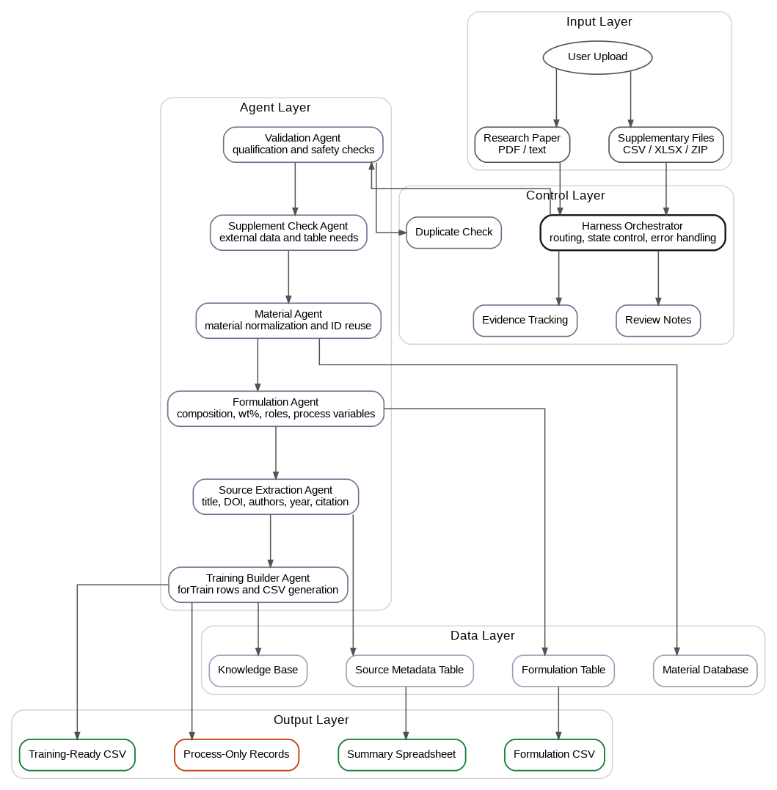
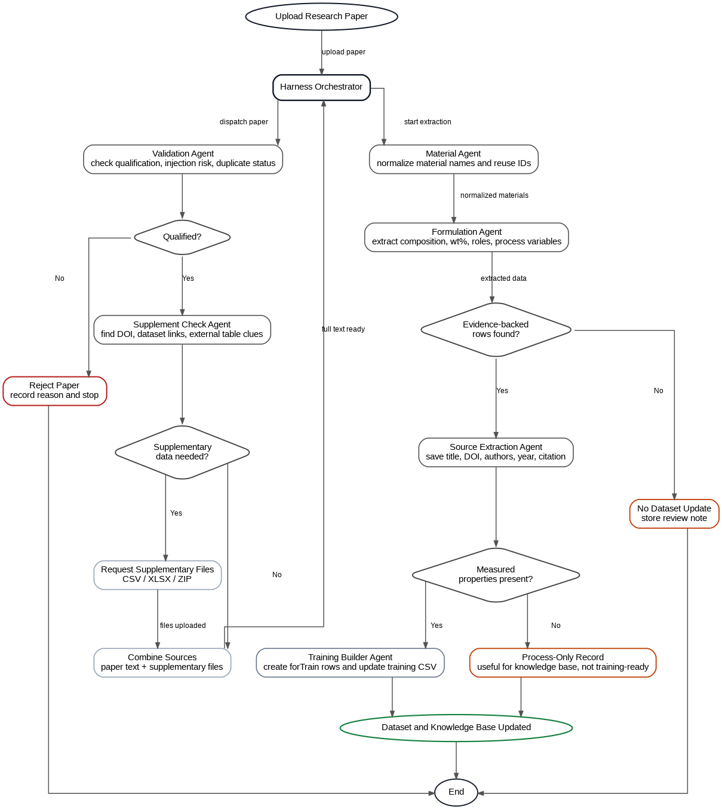

# Bio Material Harness

Live app: https://bioharness.streamlit.app/

Bio Material Harness is a secure agent harness for turning biomaterial research papers into structured CSV datasets for machine-learning work. It validates uploaded papers, rejects irrelevant or unsafe inputs, extracts evidence-backed material/formulation data, and exports training-ready CSV bundles.

The project maps the assignment idea of an extensible agent harness to a biomaterial data workflow:

```text
research paper + optional supplementary tables
        -> validation agent
        -> source metadata
        -> material/formulation datasets
        -> forTrain ML CSVs
        -> read-only dataset assistant
```

## Architecture

The harness is layered so the LLM is never the only authority. The UI, validation gates, extraction agents, CSV writers, logs, export commands, and assistant have separate responsibilities.



The working flow starts with paper upload and ends only when data is either safely written to local CSVs or rejected with a logged reason.



## What It Does

1. Upload a PDF/TXT/MD paper or paste paper text.
2. Validate that it is a real biomaterial/formulation paper.
3. Reject invalid, duplicate, irrelevant, or prompt-injection-like papers.
4. Detect supplementary data links for valid papers.
5. Accept manual CSV/XLSX/ZIP supplementary evidence.
6. Extract source metadata, materials, formulations, components, process variables, and measured properties.
7. Normalize repeated materials so IDs stay consistent.
8. Generate `forTrain/*.csv` files for ML targets only when measured property values exist.
9. Provide a Harness Assistant for read-only data questions and explicit slash commands.
10. Export training, dataset, or audit ZIP bundles through approved commands.

Core rule:

> No evidence-backed material/formulation data means no dataset update.

## Agent Roles

- **Paper Validation Agent:** checks paper quality, biomaterial relevance, formulation signals, duplicates, and injection-like text.
- **Source Extraction Agent:** saves metadata only after validation and extraction succeed.
- **Material/Formulation Extraction Agent:** proposes structured rows from evidence.
- **Training Builder:** generates ML rows only from measured property values.
- **Harness Assistant:** answers questions from current CSV snapshots and runs only explicit approved slash commands.

## Approved Commands

The harness does not expose arbitrary shell access. Instead it exposes a small allowlist in `harness_commands.py`:

| Command | Purpose |
| --- | --- |
| `export_fortrain_zip` | ZIP current `forTrain/` CSVs for ML work. |
| `export_dataset_zip` | ZIP source, material, formulation, component, and mapping files. |
| `export_audit_bundle_zip` | ZIP datasets plus validation, rejection, applied-run, and training logs. |
| `validation_smoke_check` | Read known dataset paths and report basic health. |

These commands read allowlisted project files only. They do not execute shell commands, edit CSV rows, or touch secrets.

The same allowlist can be triggered from a small natural-language CLI:

```bash
python harness_commands.py "export the forTrain data for ML" --out exports
python harness_commands.py "run a validation smoke check"
python harness_commands.py "what commands can you run?"
```

If a request does not match an approved command, the CLI explains the available commands and limits. If an export has no matching data yet, it returns a clear message instead of crashing.

Inside Streamlit, the Harness Assistant also supports explicit slash commands:

```text
/
/help
/export_fortrain_zip
/export_dataset_zip
/export_audit_bundle_zip
/validation_smoke_check
```

Normal chat remains read-only. Slash export commands prepare a download button only when matching data exists.

## Extension Skills

The project includes local skill specifications under `skills/`:

```text
skills/biomaterial_extraction/SKILL.md
skills/export_training_data/SKILL.md
```

These files document the harness extensions:

- biomaterial extraction rules
- training export behavior

They are extension specs, not executable plugins. The app does not execute code from `skills/`, which keeps the extension surface simple and safer while still making the harness extensible.

## Model Modes

**Online GPT API** is the default mode. The app looks for the key in Streamlit secrets or `OPENAI_API_KEY`, then local `openai_key.txt` for local development.

**Offline Ollama** can call a local Ollama server, for example:

```text
http://localhost:11434
```

Example setup:

```bash
ollama pull qwen2.5:7b
```

The same validation and CSV safety rules apply in both modes.

## Outputs

Generated local outputs include:

```text
data/extraction/biomaterial_source_papers.csv
data/extraction/biomaterial_source_papers.xlsx
data/datasets/material_library.csv
data/datasets/material_name_mapping.csv
data/datasets/formulation_dataset.csv
data/datasets/formulation_components.csv
data/validation/validation_log.csv
data/validation/rejected_papers.csv
data/logs/applied_reviews.csv
forTrain/*.csv
```

Process-only formulation rows are kept in the formulation dataset. Training CSV rows are generated only when measured property values are present.

## Installation

```bash
git clone <your-repo-url>
cd BioMaterialHarness
python3 -m venv .venv
. .venv/bin/activate
pip install -r requirements.txt
streamlit run app.py
```

Then open:

```text
http://localhost:8501
```

For local online mode, create `openai_key.txt` and put only the API key inside it. Do not commit this file.

Optional OCR support requires system Tesseract:

```bash
brew install tesseract
```

## Security Discussion

This harness reads untrusted files, calls LLMs, writes CSVs, and creates ZIP exports. The main risks and mitigations are:

- **File access escaping the project:** uploads and generated outputs stay under known project folders; export commands use explicit file allowlists.
- **Shell command risk:** the app does not expose shell execution to the model or Dataset Assistant. Only named Python commands in `harness_commands.py` are available.
- **Prompt injection:** paper and supplementary text are treated as untrusted evidence; injection-like text is detected and author/system-like instructions inside papers are ignored.
- **Secrets:** `OPENAI_API_KEY` and `openai_key.txt` are not included in assistant context or export bundles. Key files are ignored by git.
- **Skills/MCP risk:** no MCP server is loaded. `skills/` files are read as project specs only and are not executed.
- **Supplementary ZIP risk:** ZIP parsing is limited to CSV/XLS/XLSX table files, large files are skipped, and extracted text is capped.
- **Dataset mutation risk:** source records are saved only after successful material/formulation extraction; training rows require measured property values.
- **Assistant risk:** normal assistant chat is read-only and cannot approve, delete, extract, or modify CSV data. Only explicit slash commands can run approved actions.

Accepted limits:

- Offline Ollama quality depends on the local model.
- OCR requires Tesseract to be installed on the system.
- Public deployments should add stronger authentication, upload limits, and file isolation.

## Deliverables Covered

- Working harness code in this repo.
- Local extension specs in `skills/`.
- README with install instructions and security discussion.
- Screenshots/architecture figures in `images/`.
- Approved command layer in `harness_commands.py`.
- Live Streamlit app link above.

## Data Responsibility

This repository should contain code, not private API keys or copyrighted/generated paper-derived datasets unless you have permission to publish them. Generated CSVs are intended for local research workflow and should be reviewed before sharing publicly.
